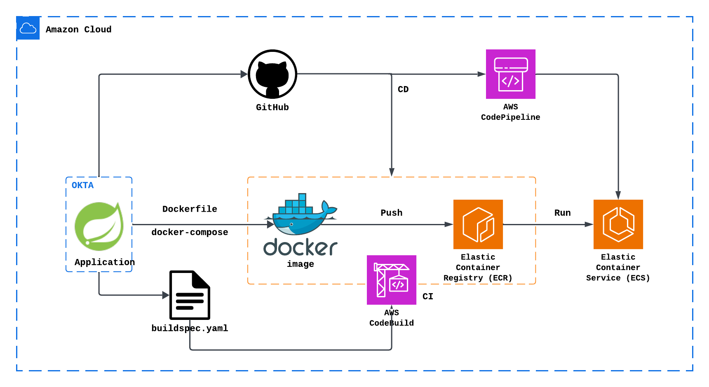

# Spring Boot Stock CRUD API

A RESTful API for managing stock data built with Spring Boot and PostgreSQL. This application provides complete CRUD operations for stock management with Docker support.

## 📋 Features

- **CRUD Operations**: Create, Read, Update, Delete stocks
- **RESTful API**: Clean REST endpoints with proper HTTP status codes
- **PostgreSQL Integration**: Uses PostgreSQL with custom schema
- **Docker Support**: Containerized application with Docker Compose
- **AWS Deployment**: Production-ready deployment on AWS ECS with RDS
- **CI/CD Pipeline**: Automated deployment using AWS CodePipeline and CodeBuild
- **Unit Tests**: Comprehensive test coverage with MockMvc
- **Postman Collection**: Ready-to-use API test collection

## 🛠️ Tech Stack

- **Backend**: Spring Boot 3.2.0, Spring Data JPA
- **Database**: PostgreSQL 15 (AWS RDS)
- **Build Tool**: Maven
- **Java Version**: 17
- **Containerization**: Docker & Docker Compose
- **Cloud Platform**: AWS (ECS, ECR, RDS, CodePipeline, CodeBuild)
- **Testing**: JUnit 5, Mockito, MockMvc

## 📊 API Endpoints

| Method | Endpoint | Description |
|--------|----------|-------------|
| GET | `/api/stocks` | Get all stocks |
| GET | `/api/stocks/{ticker}` | Get stock by ticker |
| POST | `/api/stocks` | Create new stock |
| PUT | `/api/stocks/{ticker}` | Update existing stock |
| DELETE | `/api/stocks/{ticker}` | Delete stock |

## 🚀 Quick Start

### Prerequisites

- Java 17 or higher
- Maven 3.6+
- PostgreSQL 12+ (for local setup)
- Docker & Docker Compose (for containerized setup)
- AWS CLI (for AWS deployment)
- Docker Hub account (for CI/CD pipeline)

### Option 1: Local Setup

#### 1. Clone the Repository
```bash
git clone https://github.com/dehmani89/spring-boot-sql-crud-app.git
cd spring-boot-sql-crud-app
```

#### 2. Setup PostgreSQL Database
```sql
-- Connect to PostgreSQL and run:
CREATE SCHEMA IF NOT EXISTS trading;

CREATE TABLE trading.stocks (
    id SERIAL PRIMARY KEY,
    ticker VARCHAR(10) NOT NULL UNIQUE,
    company_name VARCHAR(255) NOT NULL,
    stock_price DECIMAL(10, 2) NOT NULL,
    description TEXT
);

-- Insert sample data
INSERT INTO trading.stocks (ticker, company_name, stock_price, description)
VALUES
    ('AAPL', 'Apple Inc.', 190.25, 'Technology company specializing in consumer electronics.'),
    ('GOOGL', 'Alphabet Inc.', 135.80, 'Parent company of Google and related businesses.'),
    ('AMZN', 'Amazon.com Inc.', 145.12, 'E-commerce and cloud computing leader.'),
    ('MSFT', 'Microsoft Corp.', 365.50, 'Developer of software and cloud solutions.');
```

#### 3. Configure Database Connection
Update `src/main/resources/application.yml`:
```yaml
spring:
  datasource:
    username: your_username
    url: jdbc:postgresql://localhost:5432/your_database
    password: your_password
```

#### 4. Build and Run
```bash
# Build the application
mvn clean compile

# Run the application
mvn spring-boot:run
```

#### 5. Test the API
```bash
# Get all stocks
curl http://localhost:8080/api/stocks

# Get specific stock
curl http://localhost:8080/api/stocks/AAPL
```

### Option 2: Docker Setup (Recommended)

#### 1. Clone the Repository
```bash
git clone https://github.com/dehmani89/spring-boot-sql-crud-app.git
cd spring-boot-sql-crud-app
```

#### 2. Run with Docker Compose
```bash
# Build and start services
docker-compose up --build

# Or run in background
docker-compose up --build -d
```

#### 3. Verify Services
```bash
# Check running containers
docker ps

# View logs
docker-compose logs -f
```

#### 4. Test the API
```bash
# Get all stocks
curl http://localhost:8080/api/stocks
```

### Option 3: AWS Deployment (Production)

The application is deployed on AWS using a complete CI/CD pipeline:

#### AWS Infrastructure:
- **ECS Cluster**: Containerized application hosting
- **RDS PostgreSQL**: Managed database service
- **ECR**: Container image registry
- **CodePipeline**: Automated CI/CD workflow
- **CodeBuild**: Build and test automation

#### Deployment Process:
1. **Source**: Code changes trigger pipeline from GitHub
2. **Build**: CodeBuild creates Docker image and pushes to ECR
3. **Deploy**: ECS automatically deploys new container version

#### Environment Variables (ECS):
- `DB_USERNAME`: Database username
- `DB_PASSWORD`: Database password
- `DB_URL`: RDS connection string

#### Access Production API:
```bash
# Replace with your ECS service endpoint
curl http://your-ecs-load-balancer/api/stocks
```

## 🧪 Testing

### Run Unit Tests
```bash
mvn test
```

### Using Postman
1. Import `Stock-API-Postman-Collection.json`
2. Run the collection to test all endpoints
3. Collection includes both success and error scenarios

### Manual API Testing

#### Create Stock
```bash
curl -X POST http://localhost:8080/api/stocks \
  -H "Content-Type: application/json" \
  -d '{
    "ticker": "TSLA",
    "companyName": "Tesla Inc.",
    "price": 250.75,
    "description": "Electric vehicle company"
  }'
```

#### Update Stock
```bash
curl -X PUT http://localhost:8080/api/stocks/TSLA \
  -H "Content-Type: application/json" \
  -d '{
    "ticker": "TSLA",
    "companyName": "Tesla Inc.",
    "price": 275.50,
    "description": "Updated: Electric vehicle and energy company"
  }'
```

#### Delete Stock
```bash
curl -X DELETE http://localhost:8080/api/stocks/TSLA
```

## 🐳 Docker Commands

```bash
# Start services
docker-compose up

# Stop services
docker-compose down

# Rebuild images
docker-compose build --no-cache

# View logs
docker-compose logs -f stock-app

# Clean restart (removes data)
docker-compose down -v && docker-compose up --build
```

## 📁 Project Structure

```
src/
├── main/
│   ├── java/com/example/stockapp/
│   │   ├── controller/          # REST controllers
│   │   ├── entity/              # JPA entities
│   │   ├── repository/          # Data repositories
│   │   ├── service/             # Business logic
│   │   └── exception/           # Custom exceptions
│   └── resources/
│       ├── application.yml      # App configuration
│       └── create_stockdb.sql   # Database initialization
└── test/                        # Unit tests
```

## 🔧 Configuration

### Database Schema
- **Database**: `postgres`
- **Schema**: `trading`
- **Table**: `trading.stocks`

### Environment Variables

#### Local Development (Docker):
- `SPRING_DATASOURCE_URL`: Database connection URL
- `SPRING_DATASOURCE_USERNAME`: Database username
- `SPRING_DATASOURCE_PASSWORD`: Database password

#### AWS Production (ECS):
- `DB_USERNAME`: Database username
- `DB_PASSWORD`: Database password
- `DB_URL`: RDS PostgreSQL connection string

#### CI/CD Pipeline (CodeBuild):
- `DOCKER_HUB_USERNAME`: Docker Hub username
- `DOCKER_HUB_PASSWORD`: Docker Hub password

## 🚨 Troubleshooting

### Port Already in Use
If you get "port already in use" error:
```bash
# Stop local PostgreSQL
brew services stop postgresql

# Or check what's using the port
sudo lsof -i :5432

# if port is used, use the kill command to kill it using Process ID <PID>
sudo kill <PID>

```

### Database Connection Issues
- Verify PostgreSQL is running
- Check connection credentials in `application.yml`
- Ensure database and schema exist

### AWS ECS Deployment Issues
- Check ECS task logs in CloudWatch
- Verify security groups allow traffic between ECS and RDS (port 5432)
- Ensure environment variables are set in ECS task definition
- Confirm ECS and RDS are in the same VPC

### Docker Issues
```bash
# Clean Docker system
docker system prune -f

# Rebuild without cache
docker-compose build --no-cache
```

## 🏗️ CI/CD Pipeline

The project includes a complete CI/CD pipeline using AWS services:

### Pipeline Stages:
1. **Source**: GitHub repository integration
2. **Build**: AWS CodeBuild with `buildspec.yml`
3. **Deploy**: AWS ECS service update

### Build Process:
- Docker Hub authentication to avoid rate limits
- Docker image build and push to ECR
- ECS task definition update with new image

## 📚 Additional Resources

- [Spring Boot Documentation](https://spring.io/projects/spring-boot)
- [Spring Data JPA Guide](https://spring.io/guides/gs/accessing-data-jpa/)
- [PostgreSQL Documentation](https://www.postgresql.org/docs/)
- [Docker Compose Documentation](https://docs.docker.com/compose/)
- [AWS ECS Documentation](https://docs.aws.amazon.com/ecs/)
- [AWS CodePipeline Guide](https://docs.aws.amazon.com/codepipeline/)

## 🤝 Contributing

1. Fork the repository
2. Create a feature branch
3. Make your changes
4. Add tests for new functionality
5. Test locally with Docker Compose
6. Submit a pull request (triggers CI/CD pipeline)

## 📄 License

This project is licensed under the MIT License.